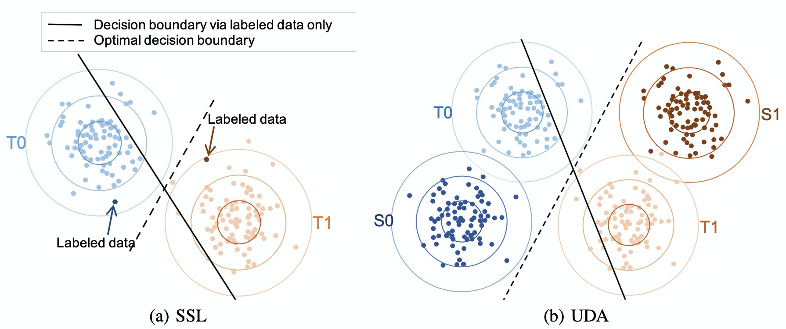
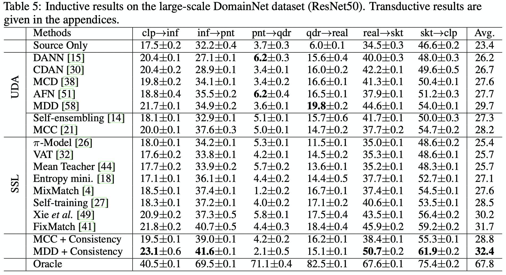

# SSL models are Strong UDA learners


## Introduction
This is the UDA and "UDA + SSL" part of the official code of paper "Semi-supervised Models are Strong Unsupervised Domain Adaptation Learners". 
It is based on pure PyTorch and presents the high effectiveness of SSL methods on UDA tasks. You can easily develop new algorithms, or readily apply existing algorithms.
Codes for SSL methods are given [here](https://github.com/YBZh/Bridging_UDA_SSL).

The currently supported algorithms include:

**Unsupervised learning for unsupervised domain adatation**
- Domain-adversarial training of neural networks (DANN, JMLR 2016)
- Conditional adversarial domain adaptation (CDAN, NIPS 2018)
- Maximum classifier discrepancy for unsupervised domain adaptation (MCD, CVPR 2018)
- Self-ensembling for visual domain adaptation (Self-ensembling, ICLR 2018)
- Larger norm more transferable: An adaptive feature norm approach for unsupervised domain adaptation (AFN, ICCV 2019)
- Bridging theory and algorithm for domain adaptation (MDD, ICML 2019)
- Minimum class confusion for versatile domain adaptation (MCC, ECCV 2020)



**UDA + SSL**
| Method          | Office31 | OfficeHome | VisDA-2017<br>(Inductive) | DomainNet |
| --------------- | :----------: | :---------: | :---------: | :---------: |
| MDD             | 88.7       | 68.5       | 73.7±0.2       | 29.7       |
| MDD+Consistency | 89.0       | 71.2       | 76.4±3.9       | 32.4       |
| MCC             | 89.8       | 70.8       | 78.3±0.4       | 28.2       |
| MCC+Consistency | 89.9       | 72.2       | 83.1±0.8       | 28.8       |

From this form we can see that the consistency gives an improvement of performance.


## Installation

This implementation is based on a variant of [Transfer-Learn codebase](https://github.com/thuml/Transfer-Learning-Library), where we slightly change the data transform and add two new method: mdd_consistency and mcc_consistency. Please refer to [Transfer-Learn codebase](https://github.com/thuml/Transfer-Learning-Library) for installation.


## Usage

The commands of our experiments on a certain dataset are written in `dataset_name.sh`, such as `domainnet.sh`. It can be run after Transfer-Learn is installed.

**Running Experiments**
```python
cd Transfer-Learning-Library/examples/domain_adaptation/classification
sh office31.sh
sh officehome.sh
sh visda.sh
sh domainnet.sh
```
We don't provide the checkpoints since the training of each model is quick and there are too many tasks.


## Contributing
Any pull requests or issues are welcome.  Models of other SSL methods on UDA tasks are highly expected.


## Citation

If you use this toolbox or benchmark in your research, please cite this project. 

```latex
@inproceedings{SSL2UDA,
  author = {xxx},
  title = {Semi-supervised Models are Strong Unsupervised Domain Adaptation Learners},
  year = {2021},
  publisher = {xxx},
  journal = {xxx},
}
```

## Acknowledgment

We would like to thank [Transfer Learning Library](https://github.com/thuml/Transfer-Learning-Library) for their excellent contribution.

## License

MIT License, the same to [Transfer Learning Library](https://github.com/thuml/Transfer-Learning-Library).


**Below are original content of Transfer-Learn library's Readme.**
- - -


## Introduction
*Transfer-Learn* is an open-source and well-documented library for Transfer Learning. It is based on pure PyTorch with high performance and friendly API. Our code is pythonic, and the design is consistent with torchvision. You can easily develop new algorithms, or readily apply existing algorithms.

The currently supported algorithms include:

##### Domain Adaptation for Classification
- Domain-Adversarial Training of Neural Networks (DANN, ICML 2015)
- Learning Transferable Features with Deep Adaptation Networks (DAN, ICML 2015)
- Deep Transfer Learning with Joint Adaptation Networks (JAN, ICML 2017)
- Conditional Adversarial Domain Adaptation (CDAN, NIPS 2018)
- Maximum Classifier Discrepancy for Unsupervised Domain Adaptation (MCD, CVPR 2018)
- Larger Norm More Transferable: An Adaptive Feature Norm Approach for
Unsupervised Domain Adaptation (AFN, ICCV 2019)
- Bridging Theory and Algorithm for Domain Adaptation (MDD, ICML 2019)
- Minimum Class Confusion for Versatile Domain Adaptation (MCC, ECCV 2020)

##### Partial Domain Adaptation
- Partial Adversarial Domain Adaptation (PADA, ECCV 2018)
- Importance Weighted Adversarial Nets for Partial Domain Adaptation (IWAN, CVPR 2018)

##### Open-set Domain Adaptation
- Open Set Domain Adaptation by Backpropagation (OSBP, ECCV 2018)

##### Domain Adaptation for Segmentation
- Unpaired Image-to-Image Translation using Cycle-Consistent Adversarial Networks (CycleGAN, ICCV 2017)
- CyCADA: Cycle-Consistent Adversarial Domain Adaptation (ICML 2018)
- ADVENT: Adversarial Entropy Minimization for Domain Adaptation in Semantic Segmentation (CVPR 2019)
- FDA: Fourier Domain Adaptation for Semantic Segmentation (CVPR 2020)

##### Domain Adaptation for Keypoint Detection
- Regressive Domain Adaptation for Unsupervised Keypoint Detection (RegDA, CVPR 2021)

##### Finetune for Classification
- Explicit inductive bias for transfer learning with convolutional networks (DELTA, ICML 2018)
- Catastrophic Forgetting Meets Negative Transfer: Batch Spectral Shrinkage for Safe Transfer Learning (BSS, NIPS 2019)
- Stochastic Normalization (StochNorm, NIPS 2020)
- Co-Tuning for Transfer Learning (Co-Tuning, NIPS 2020).

We are planning to add
- More DA methods for Segmentation
- DA for Object Detection
- Universal Domain Adaptation

The performance of these algorithms were fairly evaluated in this [benchmark](http://170.106.108.162/index.html).

## Installation

For flexible use and modification, please git clone the library.

## Documentation
You can find the tutorial and API documentation on the website: [Documentation (please open in Firefox or Safari)](http://170.106.108.162/index.html). Note that this link is only for temporary use. You can also build the doc by yourself following the instructions in http://170.106.108.162/get_started/faq.html.

Also, we have examples in the directory `examples`. A typical usage is 
```shell script
# Train a DANN on Office-31 Amazon -> Webcam task using ResNet 50.
# Assume you have put the datasets under the path `data/office-31`, 
# or you are glad to download the datasets automatically from the Internet to this path
python dann.py data/office31 -d Office31 -s A -t W -a resnet50  --epochs 20
```

In the directory `examples`, you can find all the necessary running scripts to reproduce the benchmarks with specified hyper-parameters.

## Contributing
We appreciate all contributions. If you are planning to contribute back bug-fixes, please do so without any further discussion. If you plan to contribute new features, utility functions or extensions, please first open an issue and discuss the feature with us. 

## Disclaimer on Datasets

This is a utility library that downloads and prepares public datasets. We do not host or distribute these datasets, vouch for their quality or fairness, or claim that you have licenses to use the dataset. It is your responsibility to determine whether you have permission to use the dataset under the dataset's license.

If you're a dataset owner and wish to update any part of it (description, citation, etc.), or do not want your dataset to be included in this library, please get in touch through a GitHub issue. Thanks for your contribution to the ML community!


## Contact
If you have any problem with our code or have some suggestions, including the future feature, feel free to contact 
- Junguang Jiang (JiangJunguang1123@outlook.com)
- Bo Fu (fb1121@vip.qq.com)
- Mingsheng Long (longmingsheng@gmail.com)

or describe it in Issues.

For Q&A in Chinese, you can choose to ask questions here before sending an email. [迁移学习算法库答疑专区](https://zhuanlan.zhihu.com/p/248104070)

## Citation

If you use this toolbox or benchmark in your research, please cite this project. 

```latex
@misc{dalib,
  author = {Junguang Jiang, Bo Fu, Mingsheng Long},
  title = {Transfer-Learning-library},
  year = {2020},
  publisher = {GitHub},
  journal = {GitHub repository},
  howpublished = {\url{https://github.com/thuml/Transfer-Learning-Library}},
}
```

## Acknowledgment

We would like to thank School of Software, Tsinghua University and The National Engineering Laboratory for Big Data Software for providing such an excellent ML research platform.

